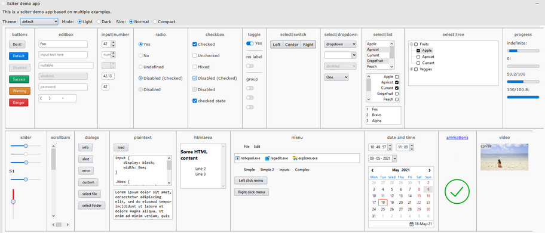

# sciter demo

This is a [sciter.js](https://sciter.com/) demo app that showcases:

- all sciter html elements (components) I found
- application theming



It's based on several sciter examples from the sciter documentation.

## demo

- git clone the repository
- install packages `npm install`
- install latest sciter sdk `npm run install-sdk`
- start the demo `npm run scapp`

## demo requirements

- A recent version of Node.js `node` (tested with 16 LTS) and its package manager `npm`.
    - On Windows [download](https://nodejs.dev/download/) and run the installer
    - On Linux check the [installation guide](https://www.digitalocean.com/community/tutorials/how-to-install-node-js-on-ubuntu-20-04#option-2-%E2%80%94-installing-node-js-with-apt-using-a-nodesource-ppa)

# sciter tips/caveats

## tutorials

[https://sciter.com/tutorials/](https://sciter.com/tutorials/)

## sciter docs

[https://github.com/c-smile/sciter-js-sdk/tree/main/docs/md](https://github.com/c-smile/sciter-js-sdk/tree/main/docs/md)

## html

sciter supports all standard elements defined in the HTML5 specification with some additions:

[https://sciter.com/developers/for-web-programmers/input-elements-map/](https://sciter.com/developers/for-web-programmers/input-elements-map/)

### include

Unlike vanilla html, it's possible to include html inside another html document:

```html
<include src="window.html" media="sciter" />
```

or

```html
<include src="fragment.htm">
  fragment.htm is not available!
</include>
```

### [short notation](https://sciter.com/sciter-html-parsing-flavour/)

Consider this input:

```html
<input type="text" name="test" id="info" class="blue">info</input>
```

in sciter there's a shorter notation:

```html
<input|text(name) #info .blue>info</input>
```

### unique elements

[https://sciter.com/developers/for-web-programmers/input-elements-map/](https://sciter.com/developers/for-web-programmers/input-elements-map/)

#### behavior

[https://github.com/c-smile/sciter-js-sdk/tree/main/docs/md/behaviors](https://github.com/c-smile/sciter-js-sdk/tree/main/docs/md/behaviors)

#### input

- `<input type="currency">`
- `<input type="decimal">`
- `<input type="integer">`
- `<input type="number">`
- `<input type="masked">` masked text input eg: phone, IP address, serial numbers
- `<input type="url">`
- `<input type="slider">` horizontal and vertical slider input
- `<input type="scrollbar">` horizontal and vertical standalone scrollbars
- `<input type="date">` date input
- `<input type="time">` time input
- `<input type="calendar">` month/year/decade/century input
- `<button type="checkbox">...</button>` checkbox combined with its label
- `<button type="radio">...</button>` radio button combined with its label
- `<button type="menu">...<menu></button>` button with popup menu
- `<button type="selector">...</button>` button with popup list of options defined in a separate popup element
- `<button type="menu">...<menu></button>` button with popup menu

#### output

- `<output type="text" value="text" />`
- `<output type="integer" value=1 />`
- `<output type="integer" value=1 />`
- `<output type="time-local" format="long|short" />`

#### select

Select elements support `multiple` and `multiple=checkmarks` attributes to allow multi-select list functionality

- `<select type="list">` standard select element
- `<select type="dropdown">` standard select element with dropdown list
- `<select type="tree">` select element with `<option>`s organized in hierarchical tree

#### popup menus

- `<popup>` popup element (preferred to be placed in `<head>`). You can show popup with Element.popupAt.
- `<menu .context>` context-menu styled element

#### text editors

- `<textarea>` standard plain text editor
- `<plaintext>` plain source code editor with line numbers and optional syntax highlighter, each line is a `<text>` element
- `<htmlarea>` ready to use WYSIWYG HTML editor

#### frames

- `<frame>` represents a nested browsing context, embedding another HTML page into the current one.
- `<frameset>` child elements to be resizable window blocks

### unique attributes

- `selectable` assign behavior: selectable
- `spellcheck` true/false enable or disable spellcheck
- `novalue` synonym of `placeholder`

## [application window](https://sciter.com/html-window/) attributes

- `window-frame` values `default|standard|solid|solid-with-shadow|extended|transparent`

    `none` or attribute omitted as whole – standard OS desktop window frame (with caption and close/maximize) buttons.
    `solid` – frameless window with non-transparent background, just a rectangular box. Window chrome needs to be defined in markup (see below).
    `solid-with-shadow` same as above but with shadow if OS supports it.
    `extended` – window that allows to replace custom elements in window’s caption bar.
    `transparent` – layered window, it’s shape is determined by background image or border-radius. CSS shall define `html { background-color:transparent }` for it.

- `window-title` title
- `window-resizable`
- `window-width` initial width of the window
- `window-height` initial height of the window
- `window-icon`  image for window decoration and in taskbar
- `lang` define dictionary for spellcheck ISO 639-1
- `window-blurbehind` create windows with blur-behind effect 

    `auto` – default OS blur-behind effect;
    `ultra-dark`, `dark`, `light` and `ultra-light`

``` html
<html
    window-frame="default"
    window-title="sciter demo app"
    window-resizable="true"
    window-width="750dip"
    window-height="1024dip"
    window-icon="images/seastar.svg"
    window-blurbehind="light"
    theme="light"
>
```

## headless window

To create a headless window use `window-frame="extended"`, then define the header components.

- `role="window-caption"` move window by clicking the element
- `role=window-close` – close button
- `role=window-icon` – window icon button
- `role=window-minimize` – minimize button
- `role=window-maximize` – maximize/restore button
- `role=window-body` or `<body>` – area (four bands) between `<html>` and that body element is used for window resizing.

``` html
<head>
...
</head>
<!-- header before the body tag -->
<header>
    <picture src="images/seastar.svg" role="window-icon" />
    <window-caption role="window-caption">sciter demo app</window-caption>
    <window-buttons>
        <window-button role="window-minimize"></window-button>
        <window-button role="window-maximize"></window-button>
        <window-button role="window-close"></window-button>
    </window-buttons>
</header>
<body>
```

### events

This doesn't work.

```html
<button #info onclick="console.log('test')">info</button>
```

Use this instead:

```js
// option 1
document.$("button#info").onclick = log;

// option 2
document.$("button#info").on("click", log);

function log()
{
    console.log('test');
}

<button #info>info</button>
```

There's [another project that explores event in more details](https://github.com/8ctopus/sciter-events)

## css

sciter supports css level 2.1 in full and has some css 3 features

[https://sciter.com/developers/for-web-programmers/](https://sciter.com/developers/for-web-programmers/)

### unique features

- gradient backgrounds, see `background-color` attribute definition
- extended image fill, see `background-position` and `background-repeat` attribute definitions
- flex length units and `flow`
- foreground images
- `hit-margin`
- `@include "mime-type" url(...) [media types list]` inclusion of scripts from css
- `size` shortcut property for `width` and `height`. If only one length value is provided then both width and height get the value. If there are two values then first one will go to width and second to height.
- supports `//` comments
- `@mixin` A named set of css properties (see below)
- `@set` A style set is a named block of style rules (see below)
- `morph` color transformation function (see below)
- css 3 `currentcolor` keyword refers to the value of the color property
- `foreground` property
- `appearance` property that suppresses default visual styles

### all supported properties

[https://sciter.com/docs/content/css/cssmap.html](https://sciter.com/docs/content/css/cssmap.html)

### display flex

sciter does not support `display: flex`, you need to use the custom css property `flow` instead.

[https://terrainformatica.com/w3/flex-layout/flex-vs-flexbox.htm](https://terrainformatica.com/w3/flex-layout/flex-vs-flexbox.htm)

### pixels

- 1`ppx` = 1 physical screen pixel = actual size depends of screen resolution
- 1`dip` = 1/96th of an inch = 0.264583mm = actual size does not depend on screen resolution

One `dip` is one `ppx` on a 96 DPI screen.

*1px can be either 1`dip` or 1`ppx` depending on SCITER_SET_PX_AS_DIP setting.*

In order to have your application size consistently accross screens with different DPI, use `dip`.

See [https://sciter.com/road-to-sciter-js-step-i-supports-px-ppx-dip/](https://sciter.com/road-to-sciter-js-step-i-supports-px-ppx-dip/)

### constants and variables

Unlike vanilla css, css constants and variables are supported.

[https://sciter.com/developers/for-web-programmers/css-constants/](https://sciter.com/developers/for-web-programmers/css-constants/)
[https://sciter.com/css-variables-support/](https://sciter.com/css-variables-support/)

### morph function

[`morph`](https://sciter.com/css-addons/) is color transformation function.

`color: morph(basecolor, transformation1:value1, transformation2:value2, ...)`

basecolor is either a constant or a variable or `currentColor`

example: `background-color: morph(currentColor, lighten:40%, opacity:50%)`

## javascript

sciter uses the [QuickJS++](https://github.com/c-smile/quickjspp) javascript engine. 

It adds [JSX](https://facebook.github.io/jsx/), [Mithril](https://mithril.js.org/) and [React](https://reactjs.org/) support:

    https://github.com/c-smile/quickjspp/blob/master/doc/jsx.md

In addition it contains storage in the form of a NoSQL MongoDB.

## javascript libraries support

General considerations about JS libraries and frameworks:

If library is pure JS one then it should work as it is in sciter. Example: RemarkableJS that does MD-to-HTML conversion works as it is.

If library relies on basic DOM features it may work as it is. Example: MithrilJS that works as it is in sciter.

If library relies on extended/obscure features then it will need either porting or an external porting layer. [see](https://sciter.com/forums/topic/supported-javascript-graph-library/#post-71280)

### jquery

jQuery does not work in Sciter as JQuery was designed to support specific browsers, but [zepto.js](https://zeptojs.com/), a lightweight port of jQuery, works.

## animations

[Lottie](https://lottiefiles.com/) animations are supported.

## mixin

Mixin is a named set of css properties that can be applied by name to css rules.

```css
@mixin STD-BUTTON-DEFAULT
{
  padding: 0 1em;
  border: 1dip solid black;
  border-radius: 3dip;
  background: linear-gradient(top, #3498db, #2980b9);
  color: #ffffff;
}
```

[https://sciter.com/mixin-feature-in-sciters-css/](https://sciter.com/mixin-feature-in-sciters-css/)

## style set

A style set is a named set of style declarations and it is a system of selectors and style definitions that are applied as the whole.

```css
@set button {
  :root {
    behavior: button;
    flow: vertical;
    @STD-BUTTON-DEFAULT;
  }

  :root:hover                   { @STD-BUTTON-HOVER; }
  :root:focus                   { @STD-BUTTON-FOCUS; }
  :root:disabled                { @STD-BUTTON-DISABLED; }
}
```

Rules within a style set can only be overriden with `!important`.

[https://terrainformatica.com/2007/04/20/css-extensions-in-h-smile-engine-part-i-style-sets/](https://terrainformatica.com/2007/04/20/css-extensions-in-h-smile-engine-part-i-style-sets/)

[https://sciter.com/style-sets-in-h-smile-core/](https://sciter.com/style-sets-in-h-smile-core/)
